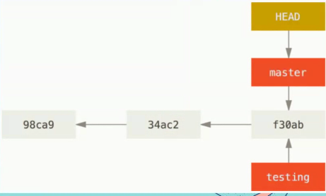
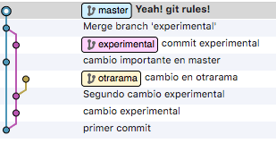
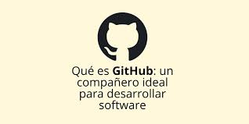
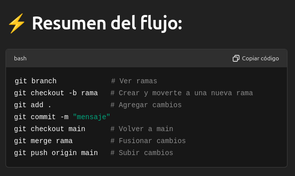
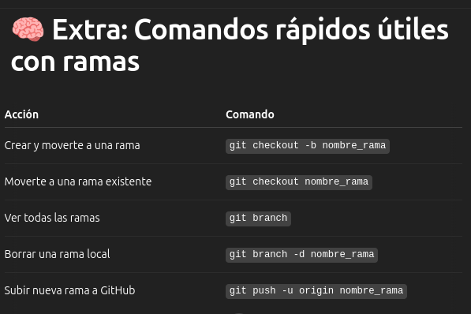

# Apuntes_GIT_2025

## 🧠 Contenido

+ 📌 Introducción a Git

+ 📁 Configuración Inicial

+ 📂 Comandos Básicos

+ 🧭 Ramas (Branches)

+ 🔁 Merge y Rebase

+ 🌐 GitHub y Repos Remotos

+ 🛠️ Buenas Prácticas

---

## 📌 Introducción a Git


Git es un sistema de control de versiones distribuido, creado por Linus Torvalds en 2005. Permite registrar y controlar cambios en archivos de forma eficiente y colaborativa.

### ¿Que es un control de versiones?

+ Es un sistemas que registra cada cambio que se realiza dentro del codigo fuente de un proyecto.

+ Permite tener un historial de todos lo cambio producidos, ademas de saber quien y cuando se hizo dicho cambio.

### ¿Por qué es importante un control de versiones

+ Rendimiento: solamente guarde lo necesario.

+ Seguridad: conserva toda accion.

+ Flexibilidad: no necesita contar con un desarrollo lineal.

---

## 📁 Configuración Inicial

Esta sección es fundamental porque configura la identidad del usuario en Git, lo cual es necesario para que cada commit que se haga quede correctamente registrado como propiedad de uno.

```bash
git config --global user.name "Alejandro (en mi caso)"
```

Esto le dice a Git que tu nombre como autor de los commits será Alejandro (en mi caso). Aparecerá en el historial de cambios junto a cada commit que hagas.

```bash
git config --global user.email "tu_correo@example.com"
```

Esto configura el correo electrónico que se asociará a tus commits. Git lo usa como un identificador único, y también es importante si se usa en plataformas como GitHub, que enlazan tu correo con tu cuenta.

---

## 📂 Comandos Básicos

```git init```
: Inicializa un repositorio

```git add .```
: Añade archivos al área de staging

```git commit -m "mensaje"```
: Guarda los cambios en el historial

```git status```
: Verifica el estado de los archivos

```git log```
: Muestra el historial de commits


---

## 🧭 Ramas (Branches)

### ¿Qué es un rama?

+ Una rama (branch) en Git es un puntero móvil a uno de los commits del historial. Cuando se crea una rama, el puntero se coloca en el commit actual, posteriormente se puede continuar trabajando y creando nuevos commits.

+ Las ramas son útiles para desarrollar funcionalidades o arreglar bugs sin afectar el código principal (rama "master" o "main").

+ Al crear una rama, puedes realizar cambios en un entorno aislado y, si los resultados son satisfactorios, fusionar (merge) la rama en la rama principal.


### Comandos basicos para Ramas en Git

Crear una rama: ```git branch nombre_rama```

Cambiar de rama: ```git checkout nombre_rama``` o ```git switch nombre_rama```

Crear y cambiar: ```git checkout -b nueva_rama```

Eliminar una rama: ```git branch -d nombre_rama```



---

## 🔁 Merge y Rebase

### 🔀 ```git merge nombre_rama```

Este comando toma los cambios de otra rama (rama) y los fusiona con la rama actual.

```bash
git checkout main
git merge rama-de-caracteristica
```

Git crea un commit de merge si hay cambios en ambas ramas.

Es ideal para mantener el historial explícito y ramificado.

### 🧱 ```git rebase nombre_rama```

Este comando reaplica los commits de la rama actual sobre la base de otra rama. El historial queda más lineal.

```bash
git checkout rama-de-caracteristica
git rebase main
```

No crea un commit de merge.

Es ideal para mantener un historial limpio y ordenado.

+ Precaución: No es recomendable hacer rebase de ramas que ya fueron compartidas con otras peersonas (porque reescribe el historial).



### ⚠️ Conflictos

Cuando Git no puede fusionar automáticamente los cambios (por ejemplo, si dos ramas modifican la misma línea de un archivo), se produce un conflicto.

#### ❓ ¿Cómo identificar un conflicto?

Después de un merge o rebase, Git te dirá algo como:

```bash
CONFLICT (content): Merge conflict in archivo.txt
Automatic merge failed; fix conflicts and then commit the result.
```

Y si se hace git status, se verá:

```bash
both modified: archivo.txt
```

### 🛠️ ¿Cómo resolver conflictos?

#### 1. Abrir el archivo con conflicto

Git marcará las zonas en conflicto así:

```bash
Versión rama actual (por ejemplo, `main`)
Versión rama que se esta integrando (por ejemplo, `rama-de-caracteristica`)
```

#### 2. Editar el archivo

Se debe decidir qué versión conservar, o combinar ambas. Luego borra los marcadores ```<<<<<<<```, ```=======```, ```>>>>>>>```.

Ejemplo resuelto:

```bash
Versión combinada o elegida por ti
```

#### 3. Marcar el conflicto como resuelto

```bash
git add archivo.txt
```

Esto le indica a Git que ya se resolvio el conflicto en ese archivo.

#### 4. Finalizar el proceso

Si se estaba haciendo merge:

```bash
git commit
```

Si se estaba haciendo rebase:

```bash
git rebase --continue
```

### 💡 Consejos para evitar conflictos

+ Mantener la comunicación con el equipo de desarrollo antes de hacer cambios grandes o significantes.

+ Sincronizar las ramas frecuentemente con git pull.

+ Usar ramas pequeñas y con un propósito claro.

+ Antes de hacer merge,es necesario asegurarse de tener la última versión de la rama destino:

```bash
git checkout main
git pull origin main
```

---

## 🌐 GitHub y Repos Remotos


+ Git permite trabajar no solo de forma local, sino también conectarse con **repositorios remotos** como los que están en GitHub, GitLab o Bitbucket. Esto facilita el trabajo colaborativo y el respaldo en la nube de nuestros proyectos.



### 🔗 Conectar un repositorio local a GitHub

Después de haber creado un repositorio en GitHub (sin inicializarlo con README, `.gitignore`, etc.), puedes enlazarlo a tu repositorio local con:

```bash
git remote add origin https://github.com/usuario/nombre-del-repo.git
```

```origin``` : es el nombre por defecto que se le da al repositorio remoto.

```https://...``` : es la URL del  repositorio en GitHub (puede ser HTTPS o SSH).

Puedes verificar que se agregó correctamente con:

```bash
git remote -v
```

### 🚀 Subir tu proyecto por primera vez

+ Una vez enlazado, debe subierse la rama principal (main o master) con:

```bash
git push -u origin main
```

```-u``` : establece una relación de seguimiento entre la rama local main y la rama remota origin/main.

+ Esto permite que en adelante puedas hacer simplemente git push sin repetir la URL o la rama.

### 📥 Obtener los cambios del remoto

Si hay nuevos cambios en el repositorio remoto (por ejemplo, porque tú u otra persona hicieron un push desde otra máquina), se puede traer esos cambios al repositorio local con:

```bash
git pull origin main
```

```pull``` : trae los cambios remotos y los fusiona con la rama actual.

+ ⚠️ Git puede generar conflictos si se modificaron las mismas partes del código que alguien más modificó.

#### 💡 Consejos adicionales

Para subir cambios luego del primer push, solo se necesita:

```bash
git push
```

Para clonar un repositorio existente de GitHub:

```bash
git clone https://github.com/usuario/nombre-del-repo.git
```

Para cambiar la URL del remoto si cometiste un error:

```bash
git remote set-url origin NUEVA_URL
```

### 📌 Flujo típico con GitHub

```bash
git init
git add .
git commit -m "Primer commit"
git remote add origin https://github.com/usuario/repositorio.git
git push -u origin main
```

Después de eso, se puede usar simplemente:

```bash
git add .
git commit -m "Tu mensaje"
git push
```

---

## 🛠️ Buenas Prácticas

Trabajar con Git no solo implica conocer los comandos, sino también aplicar buenas prácticas que hacen tu flujo de trabajo más limpio, profesional y colaborativo.

### ✅ Commits pequeños y significativos

+ Haz **commits frecuentes**, cada vez que completes una unidad de trabajo lógica.

+ Evita los commits gigantes con muchos archivos y cambios mezclados.

+ Beneficios:
  + Es más fácil revisar el historial.
  + Se pueden revertir errores sin afectar otras partes del proyecto.
  + Mejora el trabajo en equipo y la revisión de código.

Ejemplo:

```bash
git commit -m "mensaje de cambios o acciones"
```

### 📝 Mensajes de commit claros

+ Usa mensajes descriptivos, en presente y con intención clara.

+ Evita mensajes genéricos como cambios, arreglos, o cosas varias.

+ Formato recomendado:

```bash
<verbo en presente>: <qué hiciste>
```

**Ejemplo**:

+ Refactoriza función de login para mejorar legibilidad.

+ Corrige error en validación de email.

+ Agrega pruebas unitarias para componente Header.

### 🌿 Uso adecuado de ramas

Crea una rama para cada funcionalidad, corrección o mejora.

Esto permite desarrollar sin afectar la rama principal (main o master).

Ejemplo:

```bash
git checkout -b feature/agregar-carrito
```

Tipo de nombres útiles:

```feature/nombre```: para nuevas funcionalidades.

```fix/nombre```: para correcciones de errores.

```hotfix/nombre```: para arreglos urgentes.

```refactor/nombre```: para reestructuraciones internas.

### 🔄 Sincronización frecuente con el remoto

+ Antes de empezar a trabajar, se debe hacer un ```git pull``` para asegurarse de tener los últimos cambios.

+ Después de hacer tus cambios y confirmar los commits, haz ```git push``` para subirlos.

Se debe evitar trabajar días sin hacer **```push```**, ya que puede generar conflictos o dificultar la integración con el equipo de trabajo.

```bash
git pull origin main
git push origin nombre-de-tu-rama
```

### 📌 Otros consejos útiles

+ Usa ```.gitignore``` para evitar subir archivos innecesarios (como binarios, configuraciones locales o carpetas temporales).

+ Revisa siempre con git status antes de hacer commit.

+ Usa ```git log --oneline``` o herramientas gráficas para entender el historial del proyecto.

+ Si se hacen colaboraciones, se debe considerar hacer Pull Requests (PRs) en lugar de subir directo a main.




Con esto concluyo mis apuntes en cuanto al desarrollo del curso de git.

---
---
---
